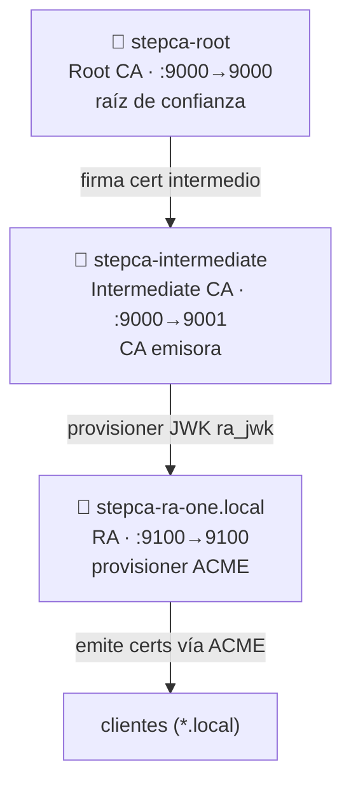

# stepca-docker

PKI jerárquica de 3 niveles con [Smallstep `step-ca`](https://smallstep.com/docs/step-ca/)
sobre Docker Compose: **Root CA → Intermediate CA → Registration Authority (RA) con ACME**.



| Servicio | Rol | Puerto host | DNS interno |
|----------|-----|-------------|-------------|
| `stepca-root` | Root CA (raíz de confianza) | `9000` | `stepca-root`, `rootca.local` |
| `stepca-intermediate` | CA emisora real | `9001` | `stepca-intermediate` |
| `stepca-ra-one.local` | Registration Authority (ACME) | `9100` | `stepca-ra-one.local` |

---

## Requisitos

- Docker Engine 20.10+ y Docker Compose v2 (`docker compose`)
- `bash`, `openssl`, `step` CLI y `jq` en el host (para los scripts auxiliares)
- En Windows: usar **WSL2** o Git Bash para los scripts `.sh`

## Quickstart

```bash
# 1. Configuración (opcional: ajustá nombres/puertos)
cp .env.example .env

# 2. Levantar TODO el stack sin pasos manuales
make up        # corre scripts/bootstrap.sh: secretos + claves + configs + arranque

# 3. Verificar salud
make status
make test      # smoke test de las 3 CAs
```

`make up` ejecuta [scripts/bootstrap.sh](scripts/bootstrap.sh), que de forma
idempotente: genera contraseñas fuertes, crea el par de claves del provisioner
`ra_jwk`, escribe las configs de la Intermediate y la RA (con el fingerprint de la
Root resuelto automáticamente) y levanta las 3 CAs en orden. No requiere Ansible
ni intervención manual.

> ⚠️ La primera vez, la Root CA genera y firma el certificado intermedio; el
> bootstrap espera a que cada CA esté `healthy` antes de seguir.

## Despliegue automatizado (Ansible)

Alternativa que destruye y recrea todo el entorno de forma idempotente:

```bash
ansible-playbook pki-ansible.yaml          # usa el dir del playbook como raíz
ansible-playbook pki-ansible.yaml -e docker_compose_dir=/ruta/al/repo
```

## Comandos útiles (Makefile)

| Comando | Acción |
|---------|--------|
| `make secrets` | Genera contraseñas fuertes en `secrets/` |
| `make up` / `make down` | Levanta / detiene el stack |
| `make reset` | **Destruye** estado y vuelve a levantar de cero |
| `make status` | Estado y salud de los servicios |
| `make logs` | Sigue los logs de los 3 servicios |
| `make test` | Smoke test end-to-end (salud de las 3 CAs) |
| `make config` | Valida `docker compose config` |

## Confiar en la Root CA (clientes)

```bash
# Exportar la raíz
docker exec stepca-root cat /home/step/certs/root_ca.crt > root_ca.crt

# Linux (Debian/Ubuntu)
sudo cp root_ca.crt /usr/local/share/ca-certificates/stepca-root.crt && sudo update-ca-certificates
# macOS
sudo security add-trusted-cert -d -r trustRoot -k /Library/Keychains/System.keychain root_ca.crt
# Windows (PowerShell admin)
Import-Certificate -FilePath root_ca.crt -CertStoreLocation Cert:\LocalMachine\Root
```

## Emitir un certificado vía ACME

La RA expone un provisioner ACME en `https://stepca-ra-one.local:9100/acme/acme/directory`.
Ver [docs/issuing-certs.md](docs/issuing-certs.md) para ejemplos con `step`, `certbot`,
nginx, Traefik y cert-manager.

## Estructura del repositorio

```
.
├── compose.yaml            # orquestación de los 3 servicios
├── .env.example            # variables de configuración (copiar a .env)
├── pki-ansible.yaml        # despliegue automatizado idempotente
├── Makefile                # atajos de operación
├── scripts/
│   ├── bootstrap.sh        # orquesta el despliegue completo (lo usa `make up`)
│   ├── gen-secrets.sh      # genera contraseñas fuertes
│   ├── init-root.sh        # crea y firma el cert intermedio
│   └── init-intermediate.sh# aprovisiona la intermedia (idempotente)
├── local_scripts/
│   └── key_ra.sh           # extrae el JWK ra_jwk → ra.key.pem para la RA
├── secrets/                # contraseñas (gitignored; solo *.example versionado)
├── persistent/             # estado de las CAs (gitignored)
└── docs/                   # documentación extendida
```

## Seguridad

Leé **[SECURITY.md](SECURITY.md)**. Resumen:

- `secrets/` y `persistent/` están en `.gitignore` — **nunca** los versiones.
- Generá contraseñas con `scripts/gen-secrets.sh`, no uses valores por defecto.
- Las versiones iniciales del repo filtraron material sensible: ver el runbook de
  purga de historial y regeneración de PKI en `SECURITY.md`.

## Documentación

| Doc | Contenido |
|-----|-----------|
| [docs/architecture.md](docs/architecture.md) | Arquitectura, niveles y flujo de aprovisionamiento |
| [docs/issuing-certs.md](docs/issuing-certs.md) | Emitir certs (step, certbot, nginx, Traefik, cert-manager) |
| [docs/acme-challenges.md](docs/acme-challenges.md) | Challenges ACME: http-01, dns-01, tls-alpn-01, device-attest-01 |
| [docs/operations.md](docs/operations.md) | Backup/restore, renovación de la intermedia, logging |
| [docs/hardening.md](docs/hardening.md) | SOPS, KMS/HSM, Root offline, políticas, CRL/OCSP |
| [docs/observability.md](docs/observability.md) | Prometheus + Grafana |
| [docs/scaling.md](docs/scaling.md) | Multi-RA y HA con DB externa |
| [docs/ci.md](docs/ci.md) | Pipeline CI, pin por digest, Dependabot |
| [examples/](examples/) | Manifiestos de clientes (cert-manager, Traefik, nginx) |
| [charts/stepca/](charts/stepca/) | Helm chart para Kubernetes |

## Perfiles de despliegue

```bash
make up                                                              # desarrollo
make prod                                                           # + límites/hardening
make ui                                                             # UI de administración (sólo lectura) en :8088
docker compose -f compose.yaml -f compose.ha.yaml up -d             # HA con PostgreSQL
docker compose -f compose.yaml -f observability/compose.observability.yaml up -d  # + métricas
```

## UI de administración

Dashboard web en `http://localhost:8088` (`make ui`): estado en vivo de las 3 CAs,
detalle de certificados, descarga de la root y provisioners ACME. Por defecto es
**sólo lectura** (no monta el socket de Docker). El modo completo (control de
servicios y emisión http-01) requiere `make ui-full`, que monta `/var/run/docker.sock`
— una superficie privilegiada, usar sólo en entornos de confianza.

## Roadmap

Plan de mejora por fases (seguridad → arranque → docs → operación → hardening →
CI → escala) en **[ROADMAP.md](ROADMAP.md)**.

## Licencia

Ver [LICENSE](LICENSE).
