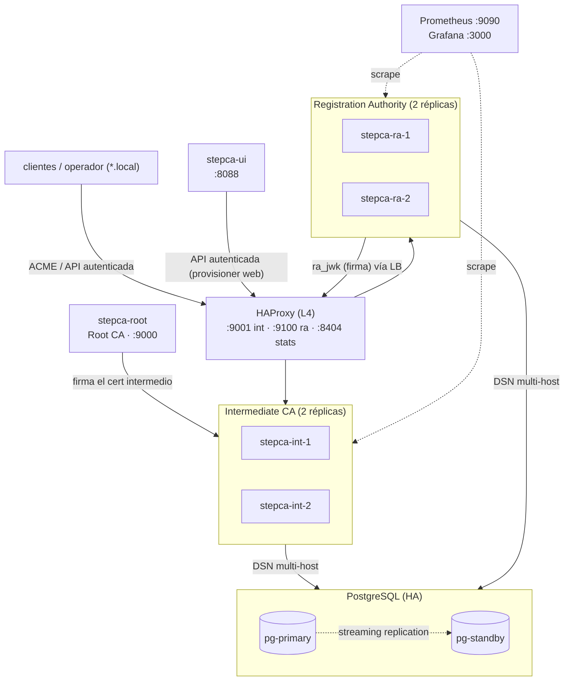

# stepca-docker

Infraestructura de **PKI (Public Key Infrastructure) privada, de alta disponibilidad**,
construida sobre [Smallstep `step-ca`](https://smallstep.com/docs/step-ca/) y orquestada
con Docker Compose. Provee una jerarquía **Root CA → Intermediate CA → Registration
Authority (RA)** con emisión de certificados por **ACME** (http-01, dns-01, tls-alpn-01,
device-attest-01) y por **provisioner JWK**, respaldada por **PostgreSQL con replicación**,
balanceada con **HAProxy**, observable con **Prometheus + Grafana** y operable desde una
**UI web** y un **cliente CLI**, ambos sin exponer el socket de Docker.

> Todo el proyecto y su documentación están en español. Pensado para entornos `*.local`
> de laboratorio/empresa, extensible a producción.

---

## Tabla de contenidos

1. [Tecnologías usadas](#tecnologías-usadas)
2. [Arquitectura](#arquitectura)
3. [Jerarquía PKI y cadena de confianza](#jerarquía-pki-y-cadena-de-confianza)
4. [Requisitos](#requisitos)
5. [Quickstart](#quickstart)
6. [Configuración](#configuración)
7. [Cómo se ejecutan las operaciones](#cómo-se-ejecutan-las-operaciones)
8. [Alta disponibilidad y failover](#alta-disponibilidad-y-failover)
9. [Acceso seguro a la PKI](#acceso-seguro-a-la-pki)
10. [UI de administración](#ui-de-administración)
11. [Observabilidad](#observabilidad)
12. [Referencia de comandos (Makefile)](#referencia-de-comandos-makefile)
13. [Estructura del repositorio](#estructura-del-repositorio)
14. [Troubleshooting](#troubleshooting)
15. [Documentación extendida](#documentación-extendida)

---

## Tecnologías usadas

| Tecnología | Rol en el proyecto |
|------------|--------------------|
| [Smallstep step-ca](https://smallstep.com/docs/step-ca/) `0.28.x` | Motor de CA: Root, Intermediate y RA; ACME; provisioners |
| [step CLI](https://smallstep.com/docs/step-cli/) | Generación de claves/CSR, emisión, bootstrap de confianza, inspección |
| Docker + Docker Compose v2 | Orquestación de todos los servicios en un único `compose.yaml` |
| [PostgreSQL 16](https://www.postgresql.org/) | Backend de datos de las CAs (DBs `stepca_int` y `stepca_ra`) |
| PostgreSQL **streaming replication** | Alta disponibilidad de datos: primario + standby con failover |
| [HAProxy 2.9](https://www.haproxy.org/) | Balanceo L4 (TCP passthrough) de las réplicas de Intermediate y RA |
| [pgx](https://github.com/jackc/pgx) (driver de step-ca) | DSN **multi-host** (`target_session_attrs=read-write`) para reconexión al primario |
| [FastAPI](https://fastapi.tiangolo.com/) + [Uvicorn](https://www.uvicorn.org/) | Backend de la UI web (Python) |
| [cryptography](https://cryptography.io/) | Parseo/inspección de certificados X.509 en la UI |
| [Prometheus](https://prometheus.io/) + [Grafana](https://grafana.com/) | Métricas y dashboards |
| [CoreDNS](https://coredns.io/) | Servidor DNS autoritativo para el demo del challenge **dns-01** |
| [lego](https://go-acme.github.io/lego/) | Cliente ACME usado en los demos (tls-alpn-01, dns-01) |
| [swtpm](https://github.com/stefanberger/swtpm) + tpm2-tools | TPM por software para el scaffold de **device-attest-01** |
| [Ansible](https://www.ansible.com/) | Playbook alternativo de despliegue declarativo (`pki-ansible.yaml`) |
| Bash | Scripts de orquestación (`bootstrap.sh`) y operación |
| ACME (RFC 8555) | Protocolo de emisión automatizada (http-01, dns-01, tls-alpn-01, device-attest-01) |

---

## Arquitectura



### Servicios (11)

| Servicio | Imagen | Puerto host | Función |
|----------|--------|-------------|---------|
| `pg-primary` | `postgres:16-alpine` | — | Primario PostgreSQL (DBs `stepca_int`, `stepca_ra`) |
| `pg-standby` | `postgres:16-alpine` | — | Standby (hot standby, replicación en streaming) |
| `stepca-root` | `smallstep/step-ca` | `9000` | Root CA: firma la intermedia (badger embebido) |
| `stepca-int-1` | `smallstep/step-ca` | (LB) | Intermediate CA réplica 1 (PostgreSQL) |
| `stepca-int-2` | `smallstep/step-ca` | (LB) | Intermediate CA réplica 2 (PostgreSQL) |
| `stepca-ra-1` | `smallstep/step-ca` | (LB) | Registration Authority réplica 1 (PostgreSQL, ACME) |
| `stepca-ra-2` | `smallstep/step-ca` | (LB) | Registration Authority réplica 2 (PostgreSQL, ACME) |
| `haproxy` | `haproxy:2.9-alpine` | `9001`,`9100`,`8404` | Balanceador L4; alias de red `stepca-intermediate`, `stepca-ra-one.local` |
| `prometheus` | `prom/prometheus` | `9090` | Métricas |
| `grafana` | `grafana/grafana` | `3000` | Dashboards |
| `stepca-ui` | `./ui` (FastAPI) | `8088` | UI web de administración y emisión segura |

**Por qué hay alias de red en HAProxy:** las réplicas se llaman `stepca-int-1/2` y
`stepca-ra-1/2`, pero los clientes (y la RA hacia la Intermediate) usan los nombres
`stepca-intermediate` y `stepca-ra-one.local`, que resuelven a HAProxy. Como el balanceo
es **L4 (TCP passthrough)**, el SNI llega intacto a la réplica, cuyo certificado de API
incluye esos nombres en el SAN. Así el balanceo es transparente y la verificación TLS
sigue siendo válida.

---

## Jerarquía PKI y cadena de confianza

```
Root CA  (auto-firmada, clave protegida con root_ca_password)
  └── Intermediate CA  (firmada por la Root; emite los certs finales)
        ├── provisioner JWK  ra_jwk   → identidad de la RA (modo stepcas)
        ├── provisioner JWK  web      → emisión desde la UI/CLI (política *.local)
        └── (vía la RA) provisioners ACME:
              ├── acme-http     → challenge http-01
              ├── acme-dns      → challenge dns-01    (permite *.local y *.test)
              ├── acme-tls      → challenge tls-alpn-01
              └── acme-device   → challenge device-attest-01 (tpm/apple/step)
```

- La **Root CA** sólo firma a la intermedia; no emite certificados finales.
- La **Intermediate CA** es la **CA emisora real**: todo cert final encadena a ella y a la Root.
- La **RA** opera en modo `stepcas`: **no tiene clave de CA propia**; delega la firma en la
  Intermediate mediante el provisioner JWK `ra_jwk`, y expone los provisioners **ACME**.
- Confianza: los clientes anclan el **`root_ca.crt`** (y verifican su **fingerprint**).

---

## Requisitos

- **Docker Engine 20.10+** y **Docker Compose v2** (`docker compose …`).
- **Bash**, **OpenSSL** y **curl** en el host (para `bootstrap.sh` y los scripts).
- En **Windows**: usar **WSL2** o **Git Bash**. Los scripts fijan `MSYS_NO_PATHCONV=1`
  para evitar la conversión de rutas de Git Bash en llamadas a `docker exec`.
- Conectividad para descargar las imágenes la primera vez.

> No hace falta tener `step`, `jq` ni `ansible` instalados en el host: el `bootstrap.sh`
> usa la imagen de step-ca para las operaciones criptográficas.

---

## Quickstart

```bash
# 1. Configuración (opcional: editar nombres, puertos, passwords)
cp .env.example .env

# 2. Levantar TODO el stack HA sin pasos manuales
make up

# 3. Verificar
make status        # estado de los 11 servicios
make test          # smoke test: salud de Root, Intermediate (LB) y RA (LB)
make stats         # URL del panel de HAProxy
```

Endpoints publicados:

| URL | Servicio |
|-----|----------|
| `https://localhost:9000` | Root CA (directo) |
| `https://localhost:9001` | Intermediate CA (vía HAProxy) |
| `https://localhost:9100` | Registration Authority / ACME (vía HAProxy) |
| `http://localhost:8404`  | HAProxy stats |
| `http://localhost:8088`  | UI de administración |
| `http://localhost:9090`  | Prometheus |
| `http://localhost:3000`  | Grafana (`admin` / `GRAFANA_PASSWORD`) |

---

## Configuración

### `.env`

Se genera copiando `.env.example`. Variables principales:

| Variable | Default | Descripción |
|----------|---------|-------------|
| `STEPCA_IMAGE` | `smallstep/step-ca:0.28.3` | Imagen de step-ca (recomendado pinear por digest en prod) |
| `STEPCA_INIT_NAME` | `Maximiliano Iriart` | Nombre/Organización de la Root CA |
| `STEPCA_INIT_DNS_NAMES` | `stepca-root, localhost, …` | SANs de la Root |
| `INTERMEDIATE_DNS` | `stepca-intermediate` | Nombre de la intermedia (debe coincidir con el alias de HAProxy) |
| `INTERMEDIATE_KEY_SIZE` | `4096` | Tamaño de clave RSA de la intermedia |
| `PG_USER` / `PG_PASSWORD` | `stepca` / `stepca-change-me` | Credenciales de PostgreSQL (embebidas en las DSN) |
| `REPLICATION_PASSWORD` | `repl-change-me` | Password del rol de replicación |
| `ROOT_PORT` / `INTERMEDIATE_PORT` / `RA_PORT` | `9000`/`9001`/`9100` | Puertos host |
| `HAPROXY_STATS_PORT` / `PROMETHEUS_PORT` / `GRAFANA_PORT` / `UI_PORT` | `8404`/`9090`/`3000`/`8088` | Puertos host |
| `UI_TOKEN` | *(vacío)* | Token de operador para **emitir desde la UI**. Vacío ⇒ UI sólo lectura |

> **Importante:** no usar comentarios inline en la misma línea de un valor de `.env`
> (rompen el parser de los scripts). Las contraseñas, sin comillas.

### Secretos

`scripts/gen-secrets.sh` (lo llama `bootstrap.sh`) genera con `openssl rand` los archivos:
`secrets/root_ca_password.txt`, `intermediate_ca_password.txt`, `ra_password.txt`,
`admin_password.txt`. **Están en `.gitignore`** (sólo se versionan los `*.example`).

### Provisioners y políticas (generados por el bootstrap)

- `ra_jwk` (JWK, en la Intermediate): clave de identidad de la RA. Sin política.
- `web` (JWK, en la Intermediate): emisión desde UI/CLI; **política X509 `allow.dns: *.local`**.
- `acme-http` / `acme-dns` / `acme-tls` / `acme-device` (ACME, en la RA): un provisioner por
  tipo de challenge, cada uno con su política (`*.local`; dns-01 también `*.test`).

Las **claims** de la Intermediate fijan la duración de los certs:
`minTLSCertDuration: 5m`, `maxTLSCertDuration: 24h`, `defaultTLSCertDuration: 24h`
(modelo de **certificados de vida corta**).

---

## Cómo se ejecutan las operaciones

### Despliegue: `bootstrap.sh` (lo invoca `make up`)

El orquestador es [`scripts/bootstrap.sh`](scripts/bootstrap.sh). Es **idempotente**
(reutiliza claves y configs existentes) y ejecuta, en orden:

1. **Secretos** — `gen-secrets.sh` crea las contraseñas si faltan.
2. **Estructura** — crea los directorios bajo `persistent/`.
3. **Par de claves `ra_jwk`** — genera (una sola vez) la clave del provisioner de la RA:
   clave privada → `persistent/ra/ra-one/secrets/ra.key.pem`; pública (JWK) → embebida en la
   config de la Intermediate.
4. **Provisioner `web`** — genera el par de claves para emisión web, su contraseña
   (`persistent/ui/web_provisioner_password`) y el `encryptedKey` (JWE compacto) embebido en
   la config de la Intermediate, con política `*.local`.
5. **Config de la Intermediate** — escribe `ca.json` con DB **PostgreSQL** (DSN multi-host
   `pg-primary,pg-standby?target_session_attrs=read-write`), `dnsNames` y los provisioners
   `ra_jwk` y `web`.
6. **PostgreSQL** — levanta `pg-primary`, espera `pg_isready`, levanta `pg-standby`
   (que se clona del primario con `pg_basebackup` y arranca como hot standby).
7. **Root CA** — la levanta; `init-root.sh` genera el CSR de la intermedia y lo **firma con
   la clave raíz**, dejando el cert en el volumen `intermediate-tmp`.
8. **Intermediate (2 réplicas) + HAProxy** — `init-intermediate.sh` copia cert/clave a su
   step-path; ambas réplicas se conectan a PostgreSQL; HAProxy las balancea. Espera health
   del LB (`https://localhost:9001/health`).
9. **Fingerprint + config de la RA** — calcula el fingerprint de la Root, copia los certs de
   confianza a la RA y escribe su `ca.json` (modo `stepcas`, DB PostgreSQL `stepca_ra`,
   apuntando a `https://stepca-intermediate:9000` —el LB— y a los 4 provisioners ACME).
10. **RA (2 réplicas) + observabilidad + UI** — las levanta y espera health del LB de la RA.

### Emisión de certificados — ACME

La RA expone **un provisioner por tipo de challenge**. La URL del directory es
`https://stepca-ra-one.local:9100/acme/<provisioner>/directory`.

| Challenge | Provisioner | Cómo valida | Demo |
|-----------|-------------|-------------|------|
| **http-01** | `acme-http` | la RA consulta `http://<dominio>/.well-known/acme-challenge/<token>` (:80) | `examples/acme/demo-http01.sh midominio.local` |
| **tls-alpn-01** | `acme-tls` | la RA conecta al :443 negociando ALPN `acme-tls/1` | `examples/acme/demo-tlsalpn01.sh midominio.local` |
| **dns-01** | `acme-dns` | la RA verifica un TXT `_acme-challenge.<dominio>` | `examples/acme/demo-dns01.sh midominio.test` |
| **device-attest-01** | `acme-device` | el dispositivo prueba su identidad con una clave atestiguada (TPM/Apple/Step) | `examples/acme/demo-deviceattest01.sh` (scaffold) |

Detalle de cada flujo, infraestructura del demo (CoreDNS para dns-01) y los hallazgos
(`.local` es mDNS → usar `.test` en dns-01; un solo TXT por nombre) en
[docs/acme-challenges.md](docs/acme-challenges.md).

Ejemplo manual con `step` (http-01, standalone):

```bash
step ca certificate app.local app.crt app.key \
  --provisioner acme-http \
  --ca-url https://stepca-ra-one.local:9100 \
  --root root_ca.crt --standalone
```

### Emisión de certificados — desde la web (UI), de forma segura

Si `UI_TOKEN` está definido, la UI habilita emitir certs `*.local`:

1. El operador ingresa el dominio y su **token** en `http://localhost:8088`.
2. El backend ejecuta (sin shell, por argv):
   `step ca certificate <dom> … --provisioner web --provisioner-password-file <secreto> --ca-url https://stepca-intermediate:9000 --root <root>`.
3. step obtiene el `encryptedKey` del provisioner `web` desde la Intermediate, lo **descifra
   con la contraseña** (único secreto que tiene la UI), firma el token y obtiene el cert.
4. El cert se guarda en `persistent/issued/` y aparece en el **inventario** de la UI.

No usa el socket de Docker ni claves de CA. La política `*.local` del provisioner acota qué
se puede emitir. Sin `UI_TOKEN`, la UI queda **sólo lectura**.

### Emisión / operación — desde la CLI, de forma segura

```bash
make step                                   # shell efímero, root pinneada por fingerprint
scripts/step-shell.sh ca health             # comando puntual
scripts/step-shell.sh ca provisioner list   # consulta autenticada
```

`step-shell.sh` levanta un contenedor `step` efímero, hace `step ca bootstrap
--fingerprint <fp>` (ancla la confianza a la Root) y opera vía la API autenticada. Sin
socket, sin claves embebidas; se borra al salir. Ver [docs/secure-access.md](docs/secure-access.md).

### Failover de PostgreSQL

```bash
make pg-status      # estado de la replicación
make pg-failover    # promueve pg-standby a primario (pg_ctl promote)
```

Las CAs usan un **DSN multi-host** con `target_session_attrs=read-write`: el driver pgx
escribe siempre en el nodo primario y, tras promover el standby, **reconecta solo** al nuevo
primario, sin reiniciar ni cambiar configuración.

### Backups y renovación

```bash
make backup         # tar consistente de secrets + persistent (detiene brevemente)
make backup-pg      # pg_dump de stepca_int y stepca_ra a backups/
make renew          # renueva el cert de la intermedia si está por vencer
make restore FILE=backups/stepca-XXXX.tar.gz
```

---

## Alta disponibilidad y failover

| Capa | Mecanismo | Failover |
|------|-----------|----------|
| **Datos** | PostgreSQL primario + standby (streaming replication) | `make pg-failover` promueve el standby; las CAs reconectan por DSN multi-host |
| **Intermediate** | 2 réplicas activas sobre la misma DB, tras HAProxy | si cae una réplica, el LB sigue sirviendo con la otra |
| **RA** | 2 réplicas activas sobre la misma DB, tras HAProxy | ídem |
| **Balanceo** | HAProxy L4 con health checks (`fall 3 / rise 2`) | saca de rotación los backends caídos |

**Verificado end-to-end**: caída de una réplica de Intermediate → el LB sigue `ok`; y tras
promover el standby de Postgres, las CAs siguen **emitiendo** (escritura en DB).

> El primario de PostgreSQL es único (failover por promoción, vía script). Para detección +
> promoción **automática** con fencing (anti split-brain), ver Patroni o pg_auto_failover.

---

## Acceso seguro a la PKI

El principio rector: **nunca el socket de Docker** para operar la PKI (equivale a root sobre
el host). Se usa la **API autenticada de step-ca** sobre TLS, con la Root **anclada por
fingerprint**. Tres vías equivalentes:

- **Web** — la UI con `UI_TOKEN` (provisioner `web`, política, token de operador).
- **CLI** — `make step` (cliente `step` efímero con pinning).
- **ACME / provisioners** — desde cualquier cliente.

Canales autenticados de step-ca: provisioners (JWK/OIDC/ACME/X5C), Admin API y mTLS. Todo
queda auditado en los logs. Detalle completo en [docs/secure-access.md](docs/secure-access.md)
y [docs/hardening.md](docs/hardening.md).

---

## UI de administración

`http://localhost:8088` (FastAPI + frontend sin dependencias), **sin socket de Docker**:

- **Estado** en vivo de Root / Intermediate / RA (health, autorefresh).
- **Certificados de las CAs**: subject, issuer, fingerprint, validez.
- **Inventario de certificados emitidos** (`persistent/issued/`): CN/SANs, serial, issuer,
  tipo de clave, "vence en", estado por color (vigente / por vencer / crítico / vencido) y
  resumen por estado.
- **Provisioners** por CA con sus tipos de challenge.
- **Emisión** (si `UI_TOKEN`): emite `*.local` vía el provisioner `web`, pidiendo el token.

---

## Observabilidad

```bash
docker compose up -d   # prometheus + grafana ya van en make up
```

- **Prometheus** (`:9090`) scrapea las réplicas (`stepca-int-1/2`, `stepca-ra-1/2`) y HAProxy.
- **Grafana** (`:3000`) carga el dashboard `observability/grafana-dashboard.json`.
- Para métricas de step-ca, habilitar `"metrics": {"enabled": true}` en `ca.json` (ver
  [docs/observability.md](docs/observability.md)).

---

## Referencia de comandos (Makefile)

| Comando | Acción |
|---------|--------|
| `make up` | Levanta el stack HA completo (bootstrap + compose) |
| `make down` | Detiene el stack (conserva el estado) |
| `make reset` | **Destruye** estado y vuelve a levantar de cero |
| `make status` / `make test` | Estado de servicios / smoke test de las 3 CAs |
| `make stats` / `make pg-status` | Info de HAProxy / estado de replicación PostgreSQL |
| `make pg-failover` | Promueve el standby a primario |
| `make step` | Cliente operador seguro (CLI) |
| `make backup` / `make backup-pg` / `make restore` | Backups y restore |
| `make renew` | Renueva el cert de la intermedia |
| `make logs` / `make config` / `make pull` | Logs / validar compose / descargar imágenes |

---

## Estructura del repositorio

```
.
├── compose.yaml                 # infraestructura HA completa (11 servicios)
├── compose.acme-demo.yaml       # overlay: CoreDNS para el demo dns-01
├── .env.example                 # variables de configuración
├── Makefile                     # atajos de operación
├── pki-ansible.yaml             # despliegue alternativo con Ansible
├── scripts/
│   ├── bootstrap.sh             # orquestador del despliegue HA (make up)
│   ├── gen-secrets.sh           # genera contraseñas fuertes
│   ├── init-root.sh             # firma el cert intermedio
│   ├── init-intermediate.sh     # aprovisiona la intermedia (idempotente)
│   ├── step-shell.sh            # cliente operador seguro (make step)
│   ├── pg-failover.sh           # promueve el standby (make pg-failover)
│   ├── backup.sh / restore.sh   # backup/restore
│   ├── renew-intermediate.sh    # renovación de la intermedia
│   └── smoke-test.sh            # salud de las 3 CAs
├── infra/
│   ├── postgres/                # primary-init.sh, standby-entry.sh
│   └── haproxy/haproxy.cfg      # balanceo L4 + stats
├── ui/                          # UI web (Dockerfile, app.py FastAPI, static/)
├── observability/               # prometheus.yml, grafana-dashboard.json
├── examples/acme/               # demos http-01, tls-alpn-01, dns-01, device-attest-01
├── charts/stepca/               # Helm chart (Kubernetes)
├── docs/                        # documentación extendida
├── secrets/                     # contraseñas (gitignored; sólo *.example versionado)
└── persistent/                  # estado de las CAs, DBs, certs emitidos (gitignored)
```

---

## Troubleshooting

| Síntoma | Causa probable | Solución |
|---------|----------------|----------|
| `env: can't execute 'bash'` en un contenedor | Scripts `.sh` con CRLF (Windows) | `.gitattributes` fuerza LF; reclonar o `dos2unix` |
| Rutas `/home/...` convertidas a `C:/Program Files/Git/...` | Conversión de Git Bash | Los scripts ya exportan `MSYS_NO_PATHCONV=1` |
| `invalid port … after host` en la DSN | Comentario inline en `.env` (`PG_PASSWORD=… # …`) | Quitar el comentario de la línea del valor |
| Standby reinicia: `max_connections … lower than primary` | El standby debe igualar GUCs del primario | `standby-entry.sh` ya arranca con `max_connections=200` |
| RA `unhealthy` con `lacked necessary authorization` | Falta el provisioner `ra_jwk` o la DB | Revisar la config de la intermedia / re-`make up` |
| dns-01 no valida sobre `.local` | `.local` está reservado para mDNS | Usar un TLD `.test` (ya aplicado en el demo) |
| UI: emisión deshabilitada | `UI_TOKEN` vacío | Definir `UI_TOKEN` en `.env` y `make up` |

Más logs: `make logs` o `docker logs <contenedor>`.

---

## Documentación extendida

| Doc | Contenido |
|-----|-----------|
| [docs/architecture.md](docs/architecture.md) | Arquitectura y flujo de aprovisionamiento |
| [docs/acme-challenges.md](docs/acme-challenges.md) | Los 4 challenges ACME en detalle + demos |
| [docs/issuing-certs.md](docs/issuing-certs.md) | Emisión (step, certbot, nginx, Traefik, cert-manager) |
| [docs/secure-access.md](docs/secure-access.md) | Modelo de interacción segura con la PKI |
| [docs/operations.md](docs/operations.md) | Backup/restore, renovación, logging |
| [docs/hardening.md](docs/hardening.md) | SOPS, KMS/HSM, Root offline, políticas, CRL/OCSP |
| [docs/scaling.md](docs/scaling.md) | Multi-RA y escalado |
| [docs/observability.md](docs/observability.md) | Prometheus + Grafana |
| [docs/ci.md](docs/ci.md) | Pipeline CI, pin por digest, Dependabot |
| [ROADMAP.md](ROADMAP.md) · [SECURITY.md](SECURITY.md) | Plan de mejora · política de seguridad |

---

## Licencia

[MIT](LICENSE).
