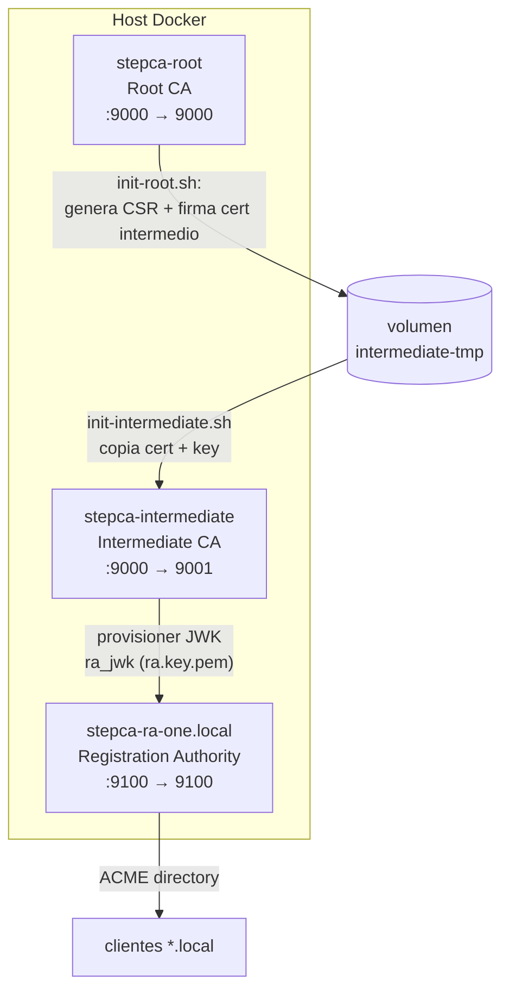

# Arquitectura

`stepca-docker` implementa una PKI jerárquica de tres niveles con `step-ca`.

## Niveles

### 1. Root CA (`stepca-root`)
- Raíz de confianza de toda la jerarquía. Auto-inicializada vía `DOCKER_STEPCA_INIT_*`.
- Al arrancar ejecuta [`scripts/init-root.sh`](../scripts/init-root.sh): genera un CSR
  para la intermedia y lo **firma con la clave raíz**, dejando el cert en el volumen
  temporal compartido `intermediate-tmp`.
- Provisioner `admin` (JWK). Vence en 2035.

### 2. Intermediate CA (`stepca-intermediate`)
- Es la **CA emisora** real. Arranca cuando la Root está `healthy`.
- [`scripts/init-intermediate.sh`](../scripts/init-intermediate.sh) copia
  `root_ca.crt`, `intermediate_ca.crt` y la clave intermedia a su step-path de forma
  idempotente, luego arranca `step-ca`.
- `enableAdmin: true`. Política X509 que solo permite DNS `*.local`.
- Duraciones TLS: min 5m, max/default 24h.

### 3. Registration Authority (`stepca-ra-one.local`)
- Modo `authority.type: stepcas`: **no tiene clave de CA propia**, delega la firma en
  la intermedia mediante el provisioner **JWK `ra_jwk`**.
- La clave del provisioner se materializa con
  [`local_scripts/key_ra.sh`](../local_scripts/key_ra.sh): extrae el `encryptedKey`
  del provisioner `ra_jwk` y lo reescribe como `ra.key.pem` (PKCS#8).
- Expone un provisioner **ACME** en `:9100` para emisión automatizada.

## Flujo de aprovisionamiento

El despliegue completo lo orquesta [`scripts/bootstrap.sh`](../scripts/bootstrap.sh)
(invocado por `make up`), sin pasos manuales ni Ansible:

1. Genera contraseñas fuertes (`gen-secrets.sh`).
2. Genera el par de claves del provisioner `ra_jwk` (clave pública → config de la
   intermedia; clave privada → `ra.key.pem` de la RA). Idempotente.
3. Escribe el `ca.json` de la Intermediate con el provisioner `ra_jwk` embebido.
4. Levanta `stepca-root` → se inicializa y `init-root.sh` firma el cert intermedio
   en el volumen `intermediate-tmp`.
5. Levanta `stepca-intermediate` → `init-intermediate.sh` copia cert+key y arranca
   como CA emisora (su DB **se persiste** en `persistent/intermediate/db`).
6. Calcula el fingerprint de la Root y escribe el `ca.json` de la RA (con la política
   `*.local` en su provisioner ACME).
7. Levanta `stepca-ra-one.local` en modo `stepcas`: obtiene su cert de identidad de
   la Intermediate vía `ra_jwk` y expone ACME.

> El playbook `pki-ansible.yaml` es una alternativa que hace lo mismo de forma
> declarativa; `bootstrap.sh` es el camino recomendado y portable.

## Almacenamiento

- Cada CA usa una base **badger v2** embebida (`/home/step/db`).
- El estado vive bajo `persistent/` (bind mounts), **excluido de git**.
- Para HA se recomienda migrar la intermedia a una DB externa (ver ROADMAP, Fase 6).

## Red y puertos

| Servicio | Interno | Host | DNS |
|----------|---------|------|-----|
| Root CA | 9000 | 9000 | `stepca-root`, `rootca.local` |
| Intermediate | 9000 | 9001 | `stepca-intermediate` |
| RA | 9100 | 9100 | `stepca-ra-one.local` |

> Los puertos del host son overridables vía `.env` (`ROOT_PORT`, `INTERMEDIATE_PORT`, `RA_PORT`).
